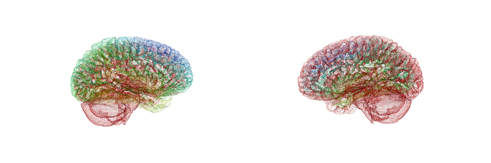

## Steven Tompson, Ph.D

Robert J. Eichelberger Distinguished Postdoctoral Fellow  
U.S. Army Research Laboratory  

### About Me

I received my PhD in Social Psychology from the University of Michigan in 2016. Since then, I have been working as a postdoctoral scholar at the University of Pennsylvania and U.S. Army Research Laboratory.

### Research Interests

Broadly, I am interested in understanding how social context, culture, and biology mutually influence behavior. I use experimental and neuroimaging methods to study how people learn about their social world (social relationships, social and cultural norms, etc.) and how this internalized knowledge about the social world in turn influences their thoughts, behaviors, and decisions.  

While in graduate school I used both behavioral and fMRI experiments to study how social and cultural factors influence decision-making, primarily in consumer and health contexts. Over the past two years as a postdoctoral researcher at the University of Pennsylvania and the U.S. Army Research Laboratory, I have been developing expertise in network approaches to analyzing neuroimaging data. In particular, I use conceptual frameworks and computational tools from the emerging field of network neuroscience to advance understanding of how networks of brain regions contribute to decision-making. Focusing on both culture and social networks, I study how people acquire and internalize information about their social context, and how that information in turn influences human behavior and decision-making. My research has examined this in four key ways: how culture influences decision-making, how social networks influence the effects of persuasive messages on health behaviors and decisions, how culture and genes interact to influence beliefs, values, and emotional experience, and how people learn information about social networks.  In future work, I plan to expand upon this work by examining how culture and social network structure influence how people learn information about their social networks, as well as how these processes develop over time, influence decisions about social relationships, and how they might facilitate acculturation processes in recent immigrants.
